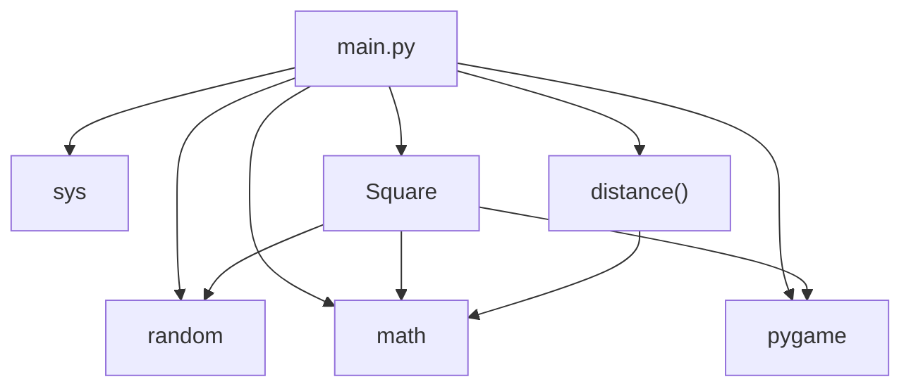
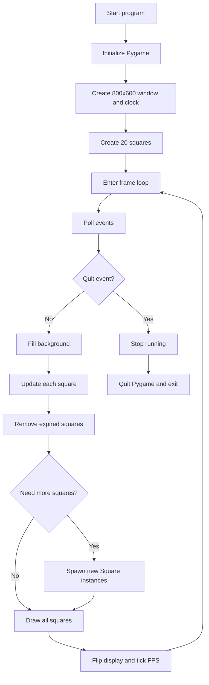
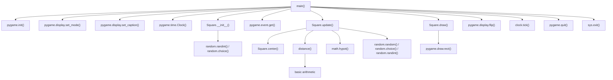
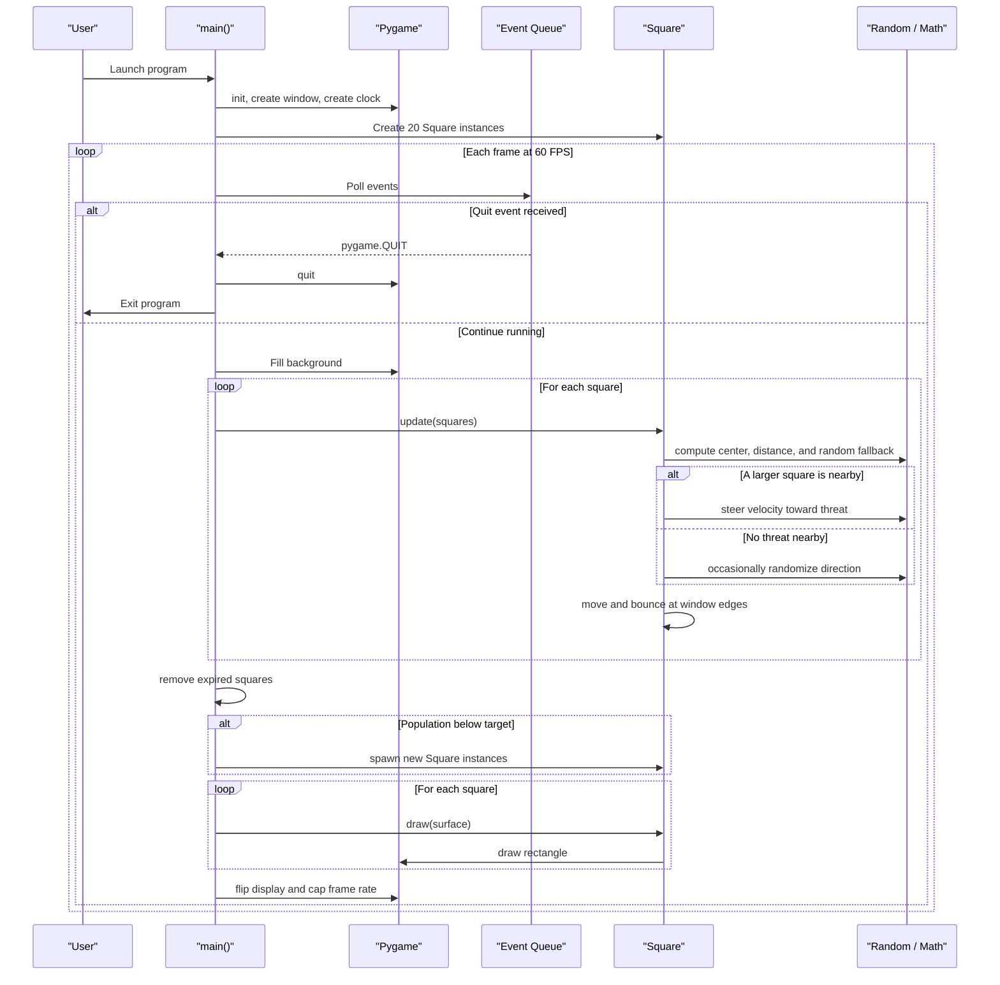

# Architecture Overview

This project is a single-file Pygame application centered on [main.py](../main.py). It initializes a window, creates a fixed population of square entities, and runs a frame loop that updates, redraws, and respawns squares until the user closes the window.

## Module Dependency Graph

## Runtime Flow

## Function Call Graph

## Sequence Diagram

## Notes

- The runtime uses `SQUARE_COUNT = 20`, even though the README still mentions 10 squares.
- `Square.update()` combines local movement, edge bouncing, threat-seeking behavior, and lifespan decay in one step.
- The app is intentionally self-contained: there are no extra project modules beyond the main entry point and dependency file.
